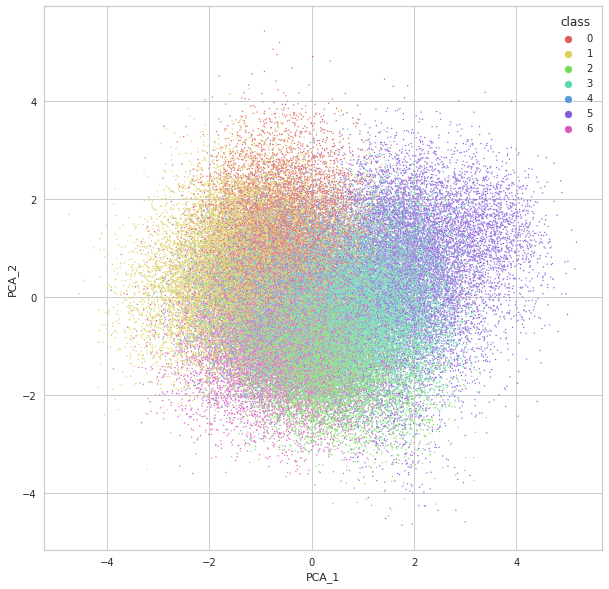
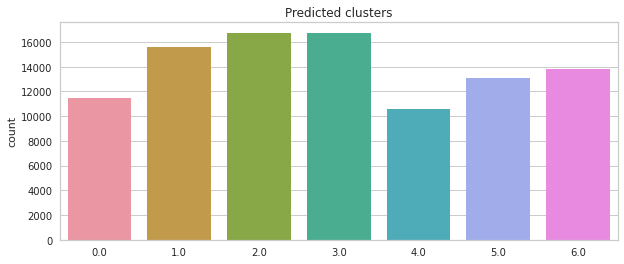

# Tabular Playground Series - Jul 2022
### By Luca Ordronneau

## Context & Objective

First ever unsupervised clustering Kaggle competition !

- Dataset where each row belongs to a particular cluster. 
- Predict the cluster each row belongs : No training data and no indication of the number of clusters

## Solution

### Data pre-processing
- PCA (Principal Component Analysis) 
- **PowerTransformer**: Makes columns more gaussian like by stabilising variance and minising skew.
### Model
- *Bayesian Gaussian Mixture* clustering with 7 clusters (elbow method thanks to KMeans clustering)

- Then, **Semi Supervised** approach base on the confidence (> 85%) of the Bayesian Gaussian Mixture clustering with application of *Random Forest Classifier* model. New confidences and took the max ones between Bayesian Gaussian Mixture and Random Forest predictions.

    <table>
	    <tr>
    	    <td style="padding:10px">
        	    
      	    </td>
            <td style="padding:10px">
            	
            </td>
        </tr>
    </table>

